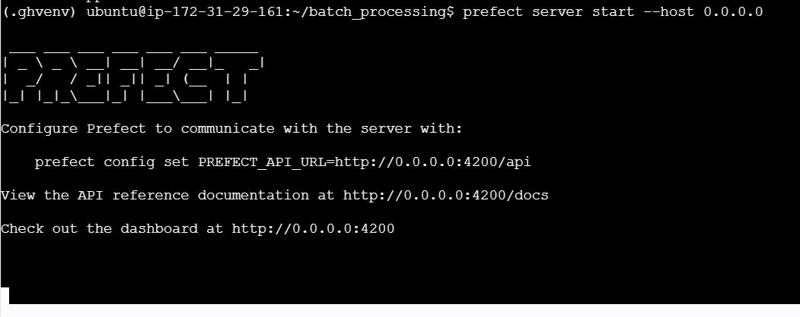
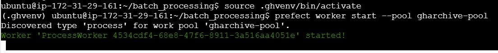

# Prefect_Demo_Setup

I have used a t2.micro EC2 instance for this set up.

Basic ec2 installations:
```bash
sudo apt-get update -y && sudo apt-get upgrade -y

sudo apt-get install -y git curl wget unzip nano
```

Install pip:
```bash
sudo apt-get update -y

sudo apt-get install -y python3-pip
```

Now let's set up prefect. The configurations and versions I'm using is:
```
Version:             2.20.22
API version:         0.8.4
Python version:      3.12.3
Git commit:          7bdb7b8e
Built:               Thu, Sep 11, 2025 9:55 AM
OS/Arch:             linux/x86_64
Profile:             default
Server type:         server
```

Before we install, let's create a python3 venv:
```bash
python3 -m venv .venv
source .venv/bin/activate
```

Now install prefect:
```bash
pip install "prefect>=2.14,<3"
```

After you're done setting up prefect on your ec2, go to prefect.io and create a free account on it. Next, scroll down to the API-Keys section on the website and create a pair of api keys. 

Go back to your ec2 instance and enter this command:
```bash
prefect cloud login
```
It will ask you for the API keys so enter the api keys and you will be logged in through your account.

In the same environment, change these wait times for Database timeouts for sqlite(execute in order):
```bash
echo 'export PREFECT_SERVER_DATABASE_CONNECTION_TIMEOUT=30' >> ~/.bashrc

echo 'export PREFECT_SERVER_DATABASE_TIMEOUT=30' >> ~/.bashrc

source ~/.bashrc
```
At this point the whole setupt is done and you're ready to launch the server.

### Start your prefect server
We will be needing multiple ssh terminal. One for the server, one for the worker and another for working on the file system.

To start your server:
```bash
prefect server start --host 0.0.0.0
```
This will start the server and will look like this:



In another terminal, run this command so that it can point to your api:
```bash
prefect config set PREFECT_API_URL="http://<your_ip_add>:4200/api"
```

### Start prefect workers

Let's first create a work pool. Work pools connect the server's scheduler to where runs actually execute.

```bash
prefect work-pool create <Your_pool_name> --type process

prefect work-pool ls
```

To start running this created worker:
```bash
prefect worker start --pool <Your_pool_name>
```



### Troubleshooting server and workers
Sometimes we might run two sessions of our prefect server or workers. To handle this, we can check if a process is already running by running these commands:
```bash
pgrep -fl "prefect worker"

pgrep -fl "prefect server"
```

Later if it shows that a proccess is running on the instance, we can clear it so that we can start all over again by running the commands respectively:
```bash
pkill -f "prefect worker"

pkill -f "prefect server"
```

### Running test scripts to understand scheduling

Let's run a sample script that extracts the current date & time once it's run. Then later we will be scheduling these runs so that it runs for an interval that is benificial for us.

####Script:
```python
from datetime import datetime, UTC
from prefect import flow, task

@task(retries=2, retry_delay_seconds=30)
def fetch_data():
    print(f"[{datetime.now(UTC)}] hello from EC2!")
    return "ok"

@flow(log_prints=True)
def prefect_flow():
    fetch_data()

if __name__ == "__main__":
    prefect_flow()
```
